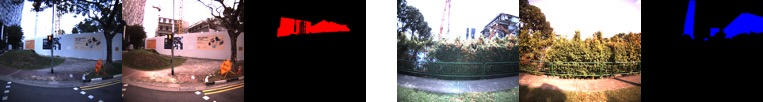

<script type="text/javascript" async
  src="https://cdnjs.cloudflare.com/ajax/libs/mathjax/2.7.5/MathJax.js?config=TeX-MML-AM_CHTML">
</script>

We propose a method for detecting structural changes in a city using images captured from vehicular mounted cameras over traversals at two different times. We first generate 3D point clouds for each traversal from the images and approximate GNSS/INS readings using Structure-from-Motion (SfM). A direct comparison of the two point clouds for change detection is not ideal due to inaccurate geo-location information and possible drifts in the SfM. To circumvent this problem, we propose a deep learning-based non-rigid registration on the point clouds which allows us to compare the point clouds for structural change detection in the scene. Furthermore, we introduce a dual thresholding check and post-processing step to enhance the robustness of our method. We collect two datasets for the evaluation of our approach. Experiments show that our method is able to detect scene changes effectively, even in the presence of viewpoint and illumination differences.


<div style="text-align: center;">
<iframe width="640" height="360" src="https://www.youtube.com/embed/Vh7A-n1Vouc" title="YouTube video player" frameborder="0" allow="accelerometer; autoplay; clipboard-write; encrypted-media; gyroscope; picture-in-picture" allowfullscreen></iframe>
</div>

If you find our work/data useful in your research, please cite:

```
@inproceedings{yew2021-CD, 
    title={City-scale Scene Change Detection using Point Clouds}, 
    author={Yew, Zi Jian and Lee, Gim Hee}, 
    booktitle={International Conference on Robotics and Automation (ICRA)},
    year={2021} 
}
```

<br>

## Dataset Download

### Disclaimer

We provide some of the raw and processed data here for download, which you can freely use for research purposes. The dataset is provided "as is", We make no warranty that the dataset will be error free, and we shall not be liable for any claim, damages or liability arising from the use of the dataset.

### Point Clouds

Our reconstructed sparse point clouds using our modified COLMAP pipeline can be downloaded in this section. We provide the point clouds in either .pcd or COLMAP format. Both contain the same point cloud, although the COLMAP version may be useful as it provides additional information such as the poses of the reconstructed cameras. For the .pcd format, we also provide our registered point clouds. In both datasets, we align run 0 (earlier run) to run 1 (later run). The point coordinates as well as camera pose are referenced to UTM coordinates (zone 48 north).

<table>
  <thead>
    <tr>
      <th> </th>
      <th>Run 0</th>
      <th>Run 1</th>
    </tr>
  </thead>
  <tbody>
    <tr>
      <td>Business District</td>
      <td>
        Raw 
          [<a href="https://mega.nz/file/okkQnArC#XdxNg7xv-7gn89TjikI4Z76PJ2tGXO8SJNmzToG-aM8" target="_blank">.pcd </a>] 
          [<a href="https://mega.nz/file/IwlAWKqY#8ixf-nlLCJEyWjN1Pr929Ao3KtfDPST6gcmaSC1y3-k" target="_blank">colmap</a>]
        <br />
        Registered 
          [<a href="https://mega.nz/file/M4s0XKzT#GQ9rq0upD0_7OZQImWuC0GfW4vnh9VAdd-GvEUMaXs8" target="_blank">.pcd</a>]
      </td>
      <td>
        Raw 
          [<a href="https://mega.nz/file/ZltCxYSK#9xcuwEL4RuIe3Sksu_q_XHAYgcdAgDUNXm1yIUcF5Aw" target="_blank">.pcd</a>] 
          [<a href="https://mega.nz/file/MttUXaAD#VF52EJKSYtlHdgPks96gBqe_tVAsvOLT25LrprL51wE" target="_blank">colmap</a>]
      </td>
    </tr>
    <tr>
      <td>Research Town</td>
      <td>
        Raw 
          [<a href="https://mega.nz/file/cl9kyIyZ#sX4Vasy2pRZ6uU6TIvbxI26QE00abSY8KNZYwlr3U9k" target="_blank">.pcd</a>] 
          [<a href="https://mega.nz/file/Eg1iEI5a#w_b8aVKbHiz1S1QNslOqL8wKHJeu4Y9NZPK612kPsFE" target="_blank">colmap</a>]
        <br />
        Registered 
          [<a href="https://mega.nz/file/QxtiHAba#OZiOMzsARZDeGYr-83Lq08nvk_CdufZ_VmX-qd9XrtM" target="_blank">.pcd</a>]
      </td>
      <td>
        Raw 
          [<a href="https://mega.nz/file/Rs9EVagY#AxhuCm1sDGfVlB1-IBlbrLmWmqt74tXEiVxNKNoRXok" target="_blank">.pcd</a>] 
          [<a href="https://mega.nz/file/J9lkkYpB#coOgx-NbtTN2bpevE-UOfN_Sv-wGfd_KSuBlJN3tzP0" target="_blank">colmap</a>]
      </td>
    </tr>
  </tbody>
</table>


### Images



The 30 annotated image pairs used for our evaluation can be downloaded from <a href="https://mega.nz/file/Nt1mDI5Z#97jrRV-a0pbqpEh7aB_zR18FtAGx--_dnmFEqL3V0_k" target="_blank">here</a> (379MB). The annotated groundtruths are in [dataset]/groundtruth folders, and are stored in a uint8 image where red/blue channels denote the appearance/disappearance of objects.

## Results

Our detected 3D changes can be downloaded [here](https://mega.nz/file/tw8AyIAQ#vtChEd4h65rdQrEKfqmE5SjrxuRchV6m7bawjXMhCfI). For both datasets the changes are stored using several files:

* <u>[dataset]/changes3d.pcd</u>: Point cloud containing the $$N$$ change points

* <u>[dataset]/reponse.bin</u>: Contains the "response" of each point in the above change point cloud. This is a binary file containing $$N$$ float32 numbers, where each number indicates the distance to the nearest point in the other point cloud. Negative number indicate the points are present in Run 2 but not Run 1, vice versa for positive numbers.

* <u>[dataset]/ref_cameras.pickle</u>: Dictionary containing the intrinsics/extrinsics for each image in Run 1. This contains a subset of the information of the COLMAP data files required to project changed points onto the image plane. For each reference image, we store a Python namedtuple ($$q_{wc}, t_{wc}, \text{intrinsics}, \text{img\_wh})$$, where
  * $$(q_{wc}, t_{wc})$$: Camera extrinsics that map points from the camera frame to the world frame as $$p_w = R_{wc} \, p_c + t_{wc}$$, where $$R_{wc}$$ is the rotation matrix corresponding to the quaternion $$q_{wc}$$
  * $$\text{intrinsics}$$: $$f_x, f_y, c_x, c_y$$, and distortion coefficients $$k_1, k_2, p_1, p_2$$
  * $$\text{img\_wh}$$: (Image width, image height)

Alternatively, you can also download our projected changes from <a href="https://mega.nz/file/Q99EWIxK#ltYbAG_iHfF7LzoTMS_GifIBTxxjxvKVa_GH__ZxOek" target="_blank">here</a>.

## Sample code

Our code repository [here](https://github.com/yewzijian/ChangeDet) contains sample code to visualize the groundtruths, project changes onto 2D, as well as to evaluate the performance.